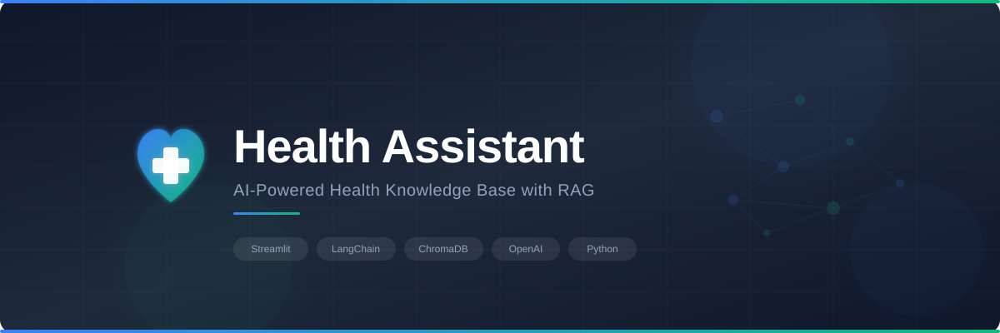

<p align="center">
  
</p>

<p align="center">
  <strong>A multi-user health assistant with agentic RAG, persistent memory, and safety guardrails — built on Streamlit and LangGraph.</strong>
</p>

<p align="center">
  
  
  
  
  
  
</p>

---

## Overview

Health Assistant is an agentic RAG application that answers health-related questions by combining a personal PDF knowledge base with web search. It uses a LangGraph StateGraph to orchestrate tool calling, retrieval grading, and persistent memory across sessions. The application features multi-user authentication, crisis detection guardrails, blood pressure tracking, token usage monitoring, and document management — all through a clean Streamlit web interface.

## Features

- **LangGraph Agent** &mdash; A StateGraph-based ReAct agent that decides which tools to call and when, with conditional routing and a configurable context window
- **Agentic RAG** &mdash; A retrieval grading node evaluates knowledge base results for relevance before the agent uses them; irrelevant results trigger automatic fallback to web search
- **Persistent Memory** &mdash; Short-term memory (conversation history within a session) and long-term memory (SQLite-backed checkpointer that persists across sessions, per user)
- **RAG-Powered Q&A** &mdash; Queries a vector store of health PDFs using hybrid retrieval (BM25 + semantic search with Reciprocal Rank Fusion), with automatic web fallback via SerpAPI
- **Blood Pressure Tracker** &mdash; Record systolic, diastolic, and pulse readings; view trends on an interactive Plotly bar chart; ask the agent to analyze your data over time
- **Token Usage & Cost Tracking** &mdash; Per-turn token counts displayed in the chat area; cumulative session totals and cost estimate in the sidebar
- **Multi-User Authentication** &mdash; Cookie-based session management with per-user data isolation for reminders, journals, blood pressure readings, and chat history
- **Safety Guardrails** &mdash; Crisis detection (regex patterns for medical/mental health emergencies) and LLM-based health topic validation with conversation context awareness
- **Rate Limiting** &mdash; Per-user sliding-window rate limiter (configurable, default 20 requests/hour)
- **Document Management** &mdash; Upload and remove PDFs through the UI with automatic vector store sync; document summaries include a transparency note when based on a subset of content
- **Health Journal** &mdash; Track health entries with optional file attachments (PDFs, images) and markdown formatting support
- **Reminders** &mdash; Date-based health reminders displayed in the sidebar
- **Five Agent Tools** &mdash; Knowledge base search, web search, document summarization, lab report analysis, and blood pressure data retrieval
- **Context Window Management** &mdash; Sliding window limits the number of messages sent to the LLM, keeping token costs under control while the full history remains in the checkpoint

## Project Structure

```
Health_Assistant/
├── app.py                     # Main Streamlit application
├── config.json                # Runtime configuration
├── credentials.yaml           # Authentication credentials
├── pyproject.toml             # Project metadata & dependencies
│
├── core/                      # Application modules
│   ├── agent.py               # LangGraph StateGraph with agentic RAG
│   ├── auth.py                # Authentication setup
│   ├── config.py              # Config loading / saving / constants
│   ├── guardrails.py          # Crisis detection & topic validation
│   ├── prompts.py             # System & tool prompt templates
│   ├── rate_limiter.py        # Per-user rate limiter
│   ├── tools.py               # LangChain tool definitions (5 tools)
│   ├── user_data.py           # User data persistence
│   ├── utils.py               # PDF extraction & source parsing utilities
│   └── vector_store.py        # Chroma vector store & hybrid retriever
│
├── scripts/                   # Utilities
│   ├── rebuild_vectorstore.py # Force-rebuild the vector store
│   └── generate_credentials.py
│
├── data/                      # Knowledge base PDFs & vector DB
│   ├── COVID-19.pdf
│   ├── Diabetes.pdf
│   ├── Hypertension.pdf
│   ├── Heart_Disease.pdf
│   ├── Physical_wellness.pdf
│   ├── Lung_Cancer.pdf
│   └── chroma_db/             # Persisted Chroma database
│
├── user_data/                 # Per-user JSON data files
├── journal_attachments/       # Journal file uploads (per user)
└── assets/                    # Static assets (CSS, images)
    ├── banner.svg
    └── style.css
```

> **Note:** `checkpoints.db` (SQLite memory store) is created at runtime and excluded from version control.

## Quick Start

### 1. Install Dependencies

This project uses [uv](https://docs.astral.sh/uv/) for dependency management.

```bash
uv sync
```

### 2. Set Up API Keys

Create a `.env` file in the project root:

```env
OPENAI_API_KEY=your_openai_api_key
SERPAPI_API_KEY=your_serpapi_api_key
```

### 3. Run the Application

```bash
streamlit run app.py
```

On first launch, the vector store will be built from the PDFs in `data/` (this may take a few minutes). Subsequent launches load the persisted database instantly.

### 4. Log In

Use one of the demo accounts or create your own via `scripts/generate_credentials.py`:

| Username | Password |
|----------|----------|
| alice    | temp123  |
| bob      | temp456  |

## Configuration

Edit `config.json` to customize behavior:

```json
{
  "pdf_files": ["data/COVID-19.pdf", "data/Diabetes.pdf", "..."],
  "chroma_directory": "data/chroma_db",
  "chunking": {
    "chunk_size": 500,
    "chunk_overlap": 50
  },
  "retriever": { "k": 3 },
  "llm": {
    "model": "gpt-4o-mini",
    "temperature": 0,
    "max_context_messages": 20
  },
  "rate_limit": {
    "max_requests": 20,
    "window_seconds": 3600
  },
  "limits": {
    "summary_max_chars": 10000,
    "lab_report_max_chars": 4000
  }
}
```

| Option | Description |
|--------|-------------|
| `pdf_files` | PDFs included in the knowledge base |
| `chroma_directory` | Vector database storage path |
| `chunk_size` | Characters per document chunk |
| `chunk_overlap` | Overlap between chunks for context continuity |
| `retriever.k` | Number of chunks retrieved per query |
| `llm.model` | OpenAI model (e.g. `gpt-4o-mini`, `gpt-4o`) |
| `llm.temperature` | 0 = deterministic, 1 = creative |
| `llm.max_context_messages` | Max recent messages sent to the LLM per turn |
| `rate_limit.max_requests` | Max requests per user per window |
| `rate_limit.window_seconds` | Sliding window duration in seconds |
| `limits.summary_max_chars` | Max characters of document text sent for summarization |
| `limits.lab_report_max_chars` | Max characters of lab report text sent for analysis |

## Architecture

```
User Question
     │
     ▼
┌─────────────┐
│  Guardrails │──→ Crisis? → Emergency resources
│  (Safety)   │──→ Off-topic? → Redirect (with conversation context)
└─────┬───────┘
      │
      ▼
┌─────────────┐
│ Rate Limiter│──→ Over limit? → Wait message
└─────┬───────┘
      │
      ▼
┌─────────────────── LangGraph StateGraph ───────────────────┐
│                                                             │
│  ┌────────────┐     ┌──────────────────┐                    │
│  │ agent_node │────→│     tool_node    │                    │
│  │   (LLM)   │     │                  │                    │
│  │            │     │ • search_kb      │                    │
│  │ Decides    │     │ • search_web     │                    │
│  │ which tool │     │ • summarize_doc  │                    │
│  │ to call    │     │ • analyze_lab    │                    │
│  │            │     │ • get_bp_data    │                    │
│  └──────┬─────┘     └────────┬─────────┘                    │
│         │                    │                              │
│         │              ┌─────▼──────────┐                   │
│   No tool calls        │grade_retrieval │                   │
│         │              │                │                   │
│         ▼              │ KB results     │                   │
│        END             │ relevant? ─No──→ Guidance message  │
│                        │   │            │  (try web search) │
│                        │  Yes           │                   │
│                        │   │            │                   │
│                        └───┼────────────┘                   │
│                            │                                │
│                            └──→ back to agent_node          │
│                                                             │
│  ┌──────────────┐                                           │
│  │ SqliteSaver  │  Persistent memory (per-user threads)     │
│  │ Checkpointer │  Saves state after every node execution   │
│  └──────────────┘                                           │
└─────────────────────────────────────────────────────────────┘
      │
      ▼
   Response with sources & token usage
```

## Safety

Health Assistant includes multiple safety layers:

- **Crisis Detection** &mdash; Regex patterns identify medical emergencies (chest pain, stroke symptoms) and mental health crises (suicidal ideation, self-harm), immediately providing emergency resources (911, 988 Suicide & Crisis Lifeline)
- **Health Topic Validation** &mdash; An LLM classifier ensures queries are health-related before processing; uses recent conversation context to correctly handle follow-up queries and document operations
- **Content Boundaries** &mdash; The system prompt prohibits diagnosis, medication prescriptions, and treatment plans; all responses include a disclaimer to consult a healthcare professional
- **Rate Limiting** &mdash; Prevents abuse with per-user request throttling

## Updating the Knowledge Base

### Via the UI

Navigate to the **Manage Documents** tab to upload or remove PDFs. The vector store updates automatically.

### Manually

1. Place new PDFs in `data/`
2. Add their paths to `config.json`
3. Rebuild:
   ```bash
   python scripts/rebuild_vectorstore.py
   ```

## Built With

- [Streamlit](https://streamlit.io/) &mdash; Web interface
- [LangGraph](https://langchain-ai.github.io/langgraph/) &mdash; Agent orchestration, state management & checkpointing
- [LangChain](https://www.langchain.com/) &mdash; Tools, retrievers & LLM integration
- [ChromaDB](https://www.trychroma.com/) &mdash; Vector storage & semantic search
- [OpenAI](https://openai.com/) &mdash; LLM (GPT-4o-mini) & embeddings
- [SerpAPI](https://serpapi.com/) &mdash; Web search fallback
- [Plotly](https://plotly.com/python/) &mdash; Blood pressure trend charts
